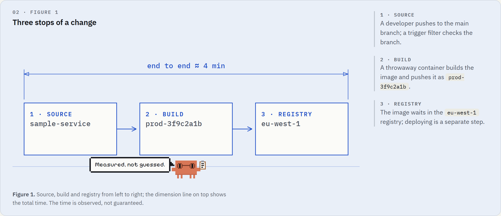

**English** | [Türkçe](README.tr.md)

<div align="center">
  <picture>
    <source media="(prefers-color-scheme: dark)" srcset=".github/assets/hero-dark.png">
    
  </picture>

  <h1>Hendese</h1>

  <p><strong>A blueprint-style design language for technical pages that explain by measuring.</strong></p>

  <p>
    <a href="https://github.com/Ilhanemreadak/hendese/actions/workflows/ci.yml"></a>
    <a href="https://github.com/Ilhanemreadak/hendese/releases"></a>
    <a href="LICENSE"></a>
  </p>

  <p>
    <a href="docs/index.html">Docs</a> ·
    <a href="demos/index.html">Part gallery</a> ·
    <a href="starter/index.html">Starter</a> ·
    <a href="CHANGELOG.md">Changelog</a>
  </p>
</div>

*hendese* (Ottoman Turkish): geometry, the knowledge of measuring; the root of *mühendis*, "engineer".

Hendese draws documentation, training and tool pages the way an engineer draws a sheet: pencil guides, inked figures, dimension lines and a title block. It ships design tokens, layered CSS components, drawing primitives, a small scroll-scene engine and **Hoca**, a pixel mascot who walks between figures and points at what matters.

> **Status:** 0.x, maintained by one person. The API is documented and tested, but may still change between minor versions. The documentation pages and default UI strings are currently in Turkish; an English translation is planned.

## Why Hendese

- **The finished state is always correct.** HTML and CSS describe the finished drawing; animation is only the way there. With reduced motion, on narrow screens, in print or without JavaScript, readers get the complete figure.
- **One line family, no decoration.** Guides, ink, accent and dimension lines. Solid means real, dashed means example or limit. No shadows, gradients or glow.
- **Meaning lives in the text.** Drawings are `aria-hidden`; everything they show is also said in words.
- **Small and predictable.** Tokens are the single source of truth, styles sit in cascade layers (your unlayered CSS always wins), the JavaScript is one loop that sleeps when idle, and nothing is requested from the network at run time: fonts are bundled.

## Quick start

### Download

Grab `hendese-<version>.zip` from [Releases](https://github.com/Ilhanemreadak/hendese/releases). It contains `dist/`, the docs, the part gallery and the starter page.

### CDN

```html
<link rel="stylesheet" href="https://cdn.jsdelivr.net/gh/Ilhanemreadak/hendese@v0.4.0/dist/hendese.css">
<script src="https://cdn.jsdelivr.net/gh/Ilhanemreadak/hendese@v0.4.0/dist/hendese.js"></script>
```

### From source

```sh
git clone https://github.com/Ilhanemreadak/hendese.git
cd hendese && npm install && npm run build
```

The package is not on npm yet. When it is, `import * as Hendese from 'hendese'` will resolve to `dist/hendese.esm.js` and `hendese/css` to the stylesheet.

## Usage

The smallest page needs only the stylesheet:

```html
<link rel="stylesheet" href="dist/hendese.css">

<div class="co co-tip">
  <span class="co-label">Tip</span>
  <div class="co-body"><p>Pin the image tag, not <code>latest</code>.</p></div>
</div>
```

For the page shell, theme toggle, section tracking and scroll scenes, add the script and register scenes between `init()` and `start()`:

```html
<head>
  <script>/* contents of dist/head.js: sets the theme before first paint */</script>
  <link rel="stylesheet" href="dist/hendese.css">
</head>
<body>
  <!-- contents of dist/icons.svg -->
  …
  <script src="dist/hendese.js"></script>
  <script>
    Hendese.init();                       // theme, drawer, section tracking, widgets
    Hendese.pinScene({                    // optional: a scroll-driven figure
      el: '#deploy',
      render: (p, api) => { api.set('ink', p); return { hud: { stage: p < .5 ? 'build' : 'push' } }; }
    });
    Hendese.start();                      // measure, then go live where motion is allowed
  </script>
</body>
```

[`starter/index.html`](starter/index.html) is a complete page to copy from.

## Theming

Every color derives from a few tokens. To re-theme with a single color:

```css
:root {
  --accent: light-dark(#0f766e, #5eead4);    /* drawing ink, pencil and soft fills derive from it */
  --accent-2: light-dark(#0b5d57, #99f6e4);  /* link color: check its contrast yourself */
}
```

Light and dark themes follow the system preference; `[data-theme-toggle]` buttons switch and remember the choice.

## Configuration

`Hendese.init(options)`:

| Option | Default | Description |
|---|---|---|
| `strings` | Turkish | UI text: `intro`, `copy`, `copied`, `copyFail`, `toLight`, `toDark`. |
| `themeKey` | `'hendese-theme'` | Storage key for the theme choice. Also settable as `<html data-theme-key="…">` so `head.js` reads the same key. |
| `topId` | `'top'` | Id of the page-top section. |
| `englishStems` | none | `RegExp`; wraps matching English words in uppercase labels in `lang="en"` (avoids the Turkish dotted capital İ). |

Scenes: `pinScene`, `stickyScene`, `figScene` and the low-level `scene`. Runtime: `Hendese.state` (`motion`, `idle`, `section`, …), `Hendese.refresh()`, `Hendese.lockTo(id)`, `Hendese.hoca.dismiss()`. Events: `hendese:theme`, `hendese:runbook`, `hendese:explore`, `hendese:tab`.

## What's in the box

| File | Contents |
|---|---|
| `dist/hendese.css` | All layers; fonts in `dist/fonts/` with their licences. |
| `dist/hendese.inline.css` | The same, with fonts embedded, for single-file pages. |
| `dist/hendese.js` | Engine and widgets as an IIFE (global `Hendese`). |
| `dist/hendese.esm.js` | The same as an ES module. |
| `dist/head.js` | Flash-free theme snippet to inline in `<head>`. |
| `dist/icons.svg` | Icon sprite. |

## Browser support

Current versions of Chrome, Edge, Firefox and Safari (2024 engines and newer). Hendese relies on cascade layers, container queries, `:has()` and `light-dark()`. Newer features such as the Popover API, anchor positioning, invoker commands and scroll-driven animations are used as progressive enhancements with fallbacks. Live scroll scenes run at 1100 px and wider; below that, pages show the finished state.

## Accessibility

Hendese targets WCAG 2.2 AA. Every docs and demo page is checked with axe in light and dark themes on each CI run, and behaviour tests cover keyboard use of the drawer, tabs, dialog and form fields. Reduced motion, print and no-JavaScript modes always show the finished state. See [ACCESSIBILITY.md](ACCESSIBILITY.md) for how it is tested and how to report a barrier; known gaps are listed in the [pre-release review](docs/audits/2026-10-pre-release-review.md).

## Documentation

- [`docs/`](docs/index.html): tokens, components, blueprint recipes, motion engine and Hoca. Open the files in a browser; no server is needed.
- [`demos/`](demos/index.html): one page per part, with variants, states and do / don't pairs.
- [`STANDARD.md`](STANDARD.md): the rules every part follows. It is enforced by the test suite.

## Development

```sh
npm run build        # src/ → dist/, and the part pages in demos/
npm test             # build, unit tests (node:test) and the Playwright suite
npm run release      # local release: checks, npm pack, zip and a git tag
```

Visual baselines exist for Windows (`*-win32.png`) and Linux (`*-linux.png`). CI runs in the official Playwright image; to reproduce it or refresh Linux baselines locally:

```sh
docker run --rm -v "$PWD:/work" -v /work/node_modules -w /work mcr.microsoft.com/playwright:v1.63.0-noble \
  bash -c "npm ci && npx playwright test --update-snapshots=missing"
```

## Contributing

Issues and pull requests are welcome. Read [CONTRIBUTING.md](CONTRIBUTING.md) first; to report a security problem, follow [SECURITY.md](SECURITY.md).

## Versioning

[Semantic Versioning](https://semver.org). Any change to the documented contract (classes, tokens, data attributes, ids, events, storage keys, exports) is a major release. See the [changelog](CHANGELOG.md).

## Credits

- [IBM Plex Sans and IBM Plex Mono](https://github.com/IBM/plex) by IBM, and [Pixelify Sans](https://github.com/eifetx/Pixelify-Sans) by its project authors, all under the SIL Open Font License 1.1.
- Icon geometry follows the 24 px stroke conventions popularised by Feather and Lucide.

## License

Code released under the [MIT License](LICENSE). © İlhan Emre Adak. Bundled fonts keep their own licence: SIL OFL 1.1 (`dist/fonts/OFL-*.txt`).
